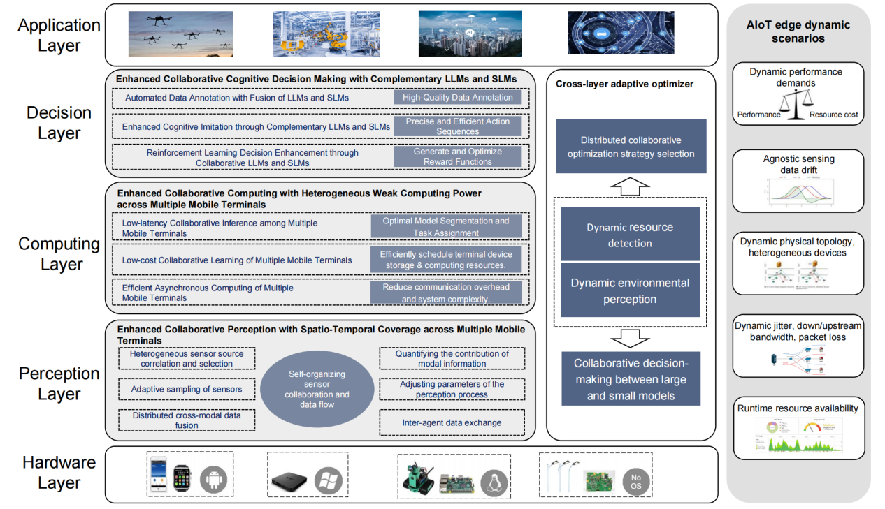
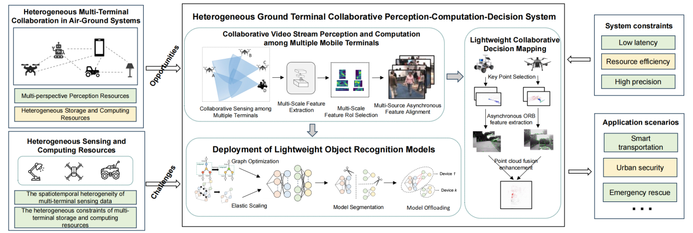
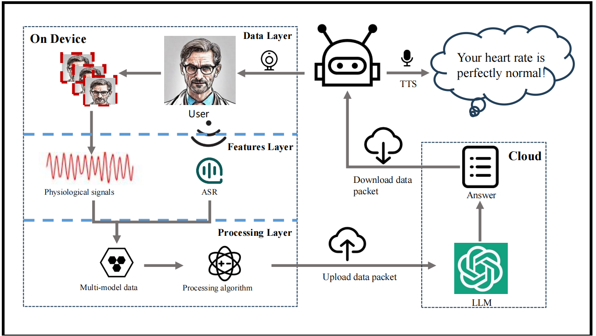

# [中国科学:数据科学]多移动终端轻量化感\-算\-策协同增强方法
# Lightweight sensing-computing-decision collaboration enhancement for multi-mobile terminals

【标题】

多移动终端轻量化感\-算\-策协同增强方法
CCF-A
文章链接：[https://doi\.org/10\.1360/SSI\-2024\-0089](https://doi.org/10.1360/SSI-2024-0089" \o "https://doi.org/10.1360/SSI-2024-0089" \t "https://www.sciengine.com/SSI/doi/10.1360/_blank)

【标签】

智能物联网, 数据融合感知, 深度模型伸缩卸载, 大小模型互馈决策, 异构系统跨层优化

【研究团队】

高元,刘思聪，郭斌，徐祥瑞：西北工业大学计算机学院，工信部智能感知与计算重点实验室

【研究意义】

“泛在智能感知、计算、决策”是物联网领域前沿基础研究课题\. 近年来, 物联网和人工智能技术的交叉融合催生出智能物联网（AI in IoT, AIoT）这一极具前景的新兴前沿领域\. 基于千亿泛在物联网移动终端（如智能手机、可穿戴设备、无人机、无人车、机器人等）, 深度学习驱动的智能感知应用/服务已逐步融入智慧城市、智能制造、社会治理、健康辅助等多个国家重大需求和民生领域\. 面向这些智能物联场景, 在产生感知传感数据的物联网终端执行合适规模的深度学习模型逐渐成为一种趋势, 其旨在将智能计算从云端下沉到物联网终端（End\-level）和边缘端 \(Edge\-level\), 具有低传输延时、保护数据隐私等优势\. 国家“十四五规划”将泛在智联的数字基础设施体系列为重点发展任务, 统筹建设“物联、数联、智联”三位一体物联网\. 著名咨询公司 Gartner 则将“边缘强化”列为十大战略技术趋势之一\.

在智能物联网中, 大量移动终端（移动及可穿戴设备、机器人、无人车等）都具有自主感知、智能计算与自主决策能力\. 与传统物联网中先在移动端终端获取传感数据后于云端处理的模式不同, 智能物联网（AIoT）移动终端可以参与到感知、计算、学习和决策的全过程中\. 在智能物联网中, 丰富多样的移动终端都具有对环境和目标的感知能力, 并能够处理、融合和理解所收集的传感数据\. 在知识层面, 根据动态情境进行自适应学习、协同决策与迁移演化, 在行为层面, 通过与其它设备的通信交流、协作交互最终做出决策反馈\. 在此背景下, 基于多移动终端的智能感知计算已成功应用于智慧交通、城市救援、地图测绘等多个重要领域\.多移动终端协作的感知\-计算\-决策可以打破单终端在视角、存算资源和性能上的极限\. 首先,单个终端的感知能力存在视野覆盖和精度上的差异, 多移动终端协同感知可以从多个视图、多个视角和多个粒度的感知中获取数据, 从而提升多粒度的感知覆盖；其次, 为了实现更优的性能, 特别是在计算速度方面, 可以通过多移动终端之间的资源互补增强来实现\. 由于单个设备的资源有限, 通过充分利用多个终端的运算和存储资源, 可以显著提高计算速度\. 通过将任务分配给多个终端, 每个终端可以独立进行计算, 提高系统的响应能力和效率\. 再次, 通过多移动终端间的资源互补增强, 我们能够充分利用可用的计算和存储资源, 从而在感知任务中实现更高的精度和效率\. 多移动终端之间可以共享彼此的计算结果和存储数据, 可以进一步减少重复计算和数据传输的需求, 进而提高整体资源利用率\.

因此, 为解决单移动终端视图下感知、计算、决策的性能受限问题, 我们期望多个移动终端在目标检测、目标分类等任务下进行协同, 实现多移动终端的“弱群智体协同增强”效果, 将不同传感器的信息进行合并理解, 从而增强对物联网所处环境的精确感知\. 然而, 现有的多移动终端感知、计算、决策技术大多未考虑存储需求、计算复杂度和硬件约束, 通常将感知获取的数据传输到具有强大运算单元的高性能工作站进行处理, 消耗网络带宽的同时也引起隐私问题, 远未形成高性能低延迟的多移动终端联合感知、计算、决策的智能物联愿景\. 为响应我国智能化转型号召, 本文提出在现有（异构）多移动终端基础设施之上通过软件系统设计实现高性能低资源要求的多移动终端感\-算\-策协同方法\. 为了兼容和适应异构多移动终端终端的弱资源（计算、存储）终端平台, 同时提升目标检测、目标分类等任务准确性, 我们需解决以下三方面的技术挑战: 

• 单移动终端感知视野及精度受限\. 单终端感知能力受到传感器感知范围和精度的约束, 并且其感知能力可能受到噪声、遮挡或者其他干扰因素的影响, 导致其无法获取全面而准确的环境或目标信息\. 已有研究对单机的最优感知配置和重采样策略进行了探索, 但是仍因多模态数据融合计算难,数据缺失与异步性同时存在等问题, 难以实现多移动终端最优协同感知策略的落地应用\. 

• 多移动终端存算资源异构受限\. 算法与系统底层要素需跨层适配物联网移动终端异构、动态的弱存算资源\. 现有多移动终端协同深度计算方法主要面向确定性资源进行预先选择最优分割和卸载策略, 模型分割、编译、存储与卸载过程紧密耦合, 一旦情境发生变化, 被动调整整个分割\-卸载过程将变得十分耗时且不切实际\. 

• 多移动终端感\-算\-策异构要素实时协作难\. 当前多移动终端的发展仍受限于多个学科及其交叉领域的影响, 在多移动终端融合感知、多维跨域协同计算与群体智能决策与控制的协作仍然有很大的不足\. 例如, 探究人机混合智能机理, 构建多移动终端协同的软硬件一体化架构, 融合多源异构的感知信息, 利用感\-算\-策多任务阶段协作及多维跨域协作策略满足高精度、高实时、高通量的应用要求也是一大挑战\.

【本文工作】

本文提出了多移动终端轻量化感\-算\-策协同增强方法, 优化异构多移动终端设备弱资源适配的同时, 满足场景自适应的低响应延迟、低存储量的性能需求\. 具体而言, 首先, 为了解决多移动终端感知过程中产生的数据冗余和缺失问题, 提出多模态数据流高效获取与融合方法\. 其次, 感知是计算的基础支撑与先决条件, 计算是感知的任务赋能环节为感知提供任务性能反馈导向；良好的决策依赖于对环境的准确感知计算, 而有效的计算有助于提供高效决策所需的信息\. 为实现聚合多移动终端本地弱存算资源协同优化, 提出感知\-认知\-决策\-存算资源的一体化协作与优化系统概念、框架以及关键技术, 有助于提升多种应用场景下的任务性能\.并进行了两项研究实践。第 2 章介绍概念与系统架构, 第 3 章介绍研究挑战及关键技术, 第 4 章介绍研究实践, 第 5 章总结全文\. 

>
>参考系统架构示意图
>
>面向动态环境的空地异构终端任务协同感-算-策系统
>
>多移动终端实时协作的多模态自主感知与问答系统
